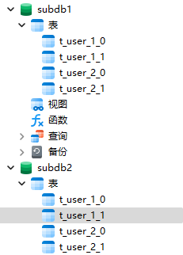

## <font color=#FFD700> 一、项目概述 </font>

#### 1、技术架构

项目总体技术选型

```
SpringBoot2.0.6 + shardingsphere4.0.0-RC1 + Maven3.5.4  + MySQL + lombok(插件)
```

#### 2、项目说明

`场景` 该例子用户验证MG的历史数据的分布分表（分两个库，以aggId为分库键，每个库个表分48个表，分十二个月，每个月4张表）

#### 3、数据库设计

`分库`  库分为**subdb2库** 和 **subdb1库**。 分库键为age字段

`分表`  t_user表分为** ["t_user_1_0","t_user_1_1","t_user_2_0","t_user_2_1"] 第一个数字是生日月份 % 2 +1, 第二个数字是年龄 % 2

**如图**


<br>


```java 核心配置
package com.oujiong.config;


import com.oujiong.ShardingAlgorithm.MyTableKeysShardingAlgorithm;
import org.apache.ibatis.session.SqlSessionFactory;
import org.apache.shardingsphere.api.config.sharding.KeyGeneratorConfiguration;
import org.apache.shardingsphere.api.config.sharding.ShardingRuleConfiguration;
import org.apache.shardingsphere.api.config.sharding.TableRuleConfiguration;
import org.apache.shardingsphere.api.config.sharding.strategy.ComplexShardingStrategyConfiguration;
import org.apache.shardingsphere.api.config.sharding.strategy.InlineShardingStrategyConfiguration;
import org.apache.shardingsphere.shardingjdbc.api.ShardingDataSourceFactory;
import org.mybatis.spring.SqlSessionFactoryBean;
import org.mybatis.spring.annotation.MapperScan;
import org.springframework.context.annotation.Bean;
import org.springframework.context.annotation.ComponentScan;
import org.springframework.context.annotation.Configuration;
import org.springframework.core.io.support.PathMatchingResourcePatternResolver;

import javax.sql.DataSource;
import java.sql.SQLException;
import java.util.HashMap;
import java.util.Map;
import java.util.Properties;


@Configuration
@ComponentScan(basePackageClasses = config.class)
@MapperScan(basePackages = "com.oujiong.mapper")
public class config {

    /**
     * SqlSessionFactory 实体
     */
    @Bean
    public SqlSessionFactory sqlSessionFactory() throws Exception {
        PathMatchingResourcePatternResolver resolver = new PathMatchingResourcePatternResolver();
        SqlSessionFactoryBean sessionFactory = new SqlSessionFactoryBean();
        sessionFactory.setDataSource(dataSource());
        sessionFactory.setFailFast(true);
        sessionFactory.setMapperLocations(resolver.getResources("classpath:/mapper/*Mapper.xml"));
        return sessionFactory.getObject();
    }

    @Bean
    public DataSource dataSource() throws SQLException {
        ShardingRuleConfiguration shardingRuleConfig = new ShardingRuleConfiguration();
        shardingRuleConfig.getTableRuleConfigs().add(getUserTableRuleConfiguration());
//        shardingRuleConfig.getBindingTableGroups().add("t_user");
//        shardingRuleConfig.getBroadcastTables().add("t_config");
//      //根据年龄分库 一共分为2个库
        shardingRuleConfig.setDefaultDatabaseShardingStrategyConfig(new InlineShardingStrategyConfiguration("age", "subdb${(age % 2)+1}"));
        //根据ID分表  一共分为2张表
        shardingRuleConfig.setDefaultTableShardingStrategyConfig(new ComplexShardingStrategyConfiguration("birthdayMonth,age", new MyTableKeysShardingAlgorithm()));
        return ShardingDataSourceFactory.createDataSource(createDataSourceMap(), shardingRuleConfig, new Properties());
    }

    private static KeyGeneratorConfiguration getKeyGeneratorConfiguration() {
        KeyGeneratorConfiguration result = new KeyGeneratorConfiguration("SNOWFLAKE", "id");
        return result;
    }

    TableRuleConfiguration getUserTableRuleConfiguration() {
        TableRuleConfiguration result = new TableRuleConfiguration("t_user_", "subdb${1..2}.t_user_${1..2}_${0..1}");
//        result.setKeyGeneratorConfig(getKeyGeneratorConfiguration());
        return result;
    }


    Map<String, DataSource> createDataSourceMap() {
        Map<String, DataSource> result = new HashMap<>();
        result.put("subdb1", DataSourceUtil.createDataSource("subdb1"));
        result.put("subdb2", DataSourceUtil.createDataSource("subdb2"));
        return result;
    }

}

```

Sharding-JDBC可以通过`Java`，`YAML`，`Spring命名空间`和`Spring Boot Starter`四种方式配置，开发者可根据场景选择适合的配置方式。具体可以看官网。

#### 2、UserController

```java
package com.oujiong.controller;


import com.google.common.collect.Lists;
import com.oujiong.model.User;
import com.oujiong.service.UserService;
import lombok.extern.slf4j.Slf4j;
import org.springframework.beans.factory.annotation.Autowired;
import org.springframework.web.bind.annotation.GetMapping;
import org.springframework.web.bind.annotation.PathVariable;
import org.springframework.web.bind.annotation.PostMapping;
import org.springframework.web.bind.annotation.RestController;

import javax.annotation.PostConstruct;
import java.util.List;
import java.util.Random;
import java.util.stream.Collectors;


@RestController
@Slf4j
public class UserController {

    @Autowired
    private UserService userService;

    /**
     * 模拟插入数据
     */
    List<User> userList = Lists.newArrayList();

    /**
     * 初始化插入数据
     */
    @PostConstruct
    private void getData() {

        for (int i = 0; i < 1000; i++) {
            userList.add(new User(new Random().nextLong(), "mock_name_" + i, "女", new Random().nextInt(10), i % 2));
        }
    }

    /**
     * @Description: 批量保存用户
     */
    @PostMapping("save-user")
    public Object saveUser() {
        return userService.insertForeach(userList);
    }

    /**
     * @Description: 获取用户列表
     */
    @GetMapping("list-user")
    public Object listUser() {
        return userService.list();
    }

    @GetMapping("query-user/{birthdayMonth}/{age}")
    public List<User> query(@PathVariable("birthdayMonth") Integer birthdayMonth, @PathVariable("age") Integer age) {

        List<User> query = userService.query(birthdayMonth, age);

        List<User> collect = query.stream().filter(user -> {
            // 过滤出数据
            return !user.getBirthdayMonth().equals(birthdayMonth);
        }).collect(Collectors.toList());

        List<User> collect2 = query.stream().filter(user -> {
            // 过滤出数据
            return !user.getAge().equals(age);
        }).collect(Collectors.toList());


        log.info("总共数据条数{}", query.size());
        // 正常必须是0
        log.info("生日不满足条件的数据条数：{}", collect.size());
        // 正常必须是0
        log.info("年龄不满足条件的数据条数：{}", collect2.size());

        return query;

    }

    @GetMapping("deleteAllUser")
    public void deleteAllUser() {
        userService.deleteAllUser();
    }


}

```
```java
public final class DataSourceUtil {

    private static final String HOST = "localhost";

    private static final int PORT = 3306;

    private static final String USER_NAME = "root";

    private static final String PASSWORD = "123456";

    public static DataSource createDataSource(final String dataSourceName) {
        DruidDataSource result = new DruidDataSource();
        result.setDriverClassName(com.mysql.jdbc.Driver.class.getName());
        result.setUrl(String.format("jdbc:mysql://%s:%s/%s?serverTimezone=UTC&useSSL=false&useUnicode=true&characterEncoding=UTF-8", HOST, PORT, dataSourceName));
        result.setUsername(USER_NAME);
        result.setPassword(PASSWORD);
        return result;
    }
}
```

三、验证

```agsl
http://localhost:8080/query-user/1/8
查询生日月份=1，年龄=8的

```
```agsl  全部满足条件
2024-04-08 15:26:28.082  INFO 21656 --- [nio-8080-exec-3] com.oujiong.controller.UserController    : 总共数据条数98
2024-04-08 15:26:28.082  INFO 21656 --- [nio-8080-exec-3] com.oujiong.controller.UserController    : 生日不满足条件的数据条数：0
2024-04-08 15:26:28.082  INFO 21656 --- [nio-8080-exec-3] com.oujiong.controller.UserController    : 年龄不满足条件的数据条数：0
```


`注意` ShardingSphere并不支持`CASE WHEN`、`HAVING`、`UNION (ALL)`，`有限支持子查询`。这个官网有详细说明。
